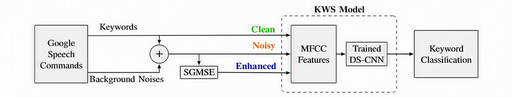

# Noise Robustness in Keyword Spotting 

**Authors:** Avital Skop, Ido Ben David  
**Supervisor:** Maya Veisman  
**Academic Supervisor:** Prof. Sharon Gannot

**[Demo Page](https://avitalskop.github.io/kws-demo/)**

---

## Description

Keyword Spotting (KWS) systems are widely used in voice assistants, smart devices, and embedded speech interfaces. However, their performance often degrades significantly in noisy acoustic environments.

This project investigates whether a speech enhancement front-end can improve keyword recognition robustness under different noise conditions and signal-to-noise ratios (SNRs).

We evaluate a DS-CNN keyword spotting model under three operating conditions:

1. Clean Speech
2. Noisy Speech
3. Enhanced Speech (Trained SGMSE → DS-CNN)

The goal is to quantify the effect of speech enhancement on keyword recognition accuracy and analyze the relationship between speech quality improvement and downstream classification performance.

---

## Architecture

  

The proposed pipeline consists of:

- Google Speech Commands dataset
- Noise injection at multiple SNR levels
- Speech enhancement using a trained SGMSE model
- MFCC feature extraction
- DS-CNN keyword spotting network
- Keyword classification

The same DS-CNN classifier is evaluated on clean, noisy, and enhanced speech to isolate the contribution of the enhancement stage.

---

## Speech Enhancement Model

The speech enhancement stage is based on the Score-based Generative Model for Speech Enhancement (SGMSE).

Two enhancement configurations were evaluated:

### 1. Pretrained SGMSE

The official pretrained SGMSE checkpoint was used directly to enhance noisy speech samples and evaluate its effect on keyword recognition performance.

### 2. Trained SGMSE

The SGMSE model was further trained on a custom dataset generated for this project. The training set consisted of clean speech signals from Google Speech Commands mixed with various real-world background noises at multiple SNR levels.

During training, multiple checkpoints were saved and evaluated using both speech enhancement metrics and keyword spotting performance.

The final checkpoint used in the experiments was selected based on the overall tradeoff between:

- PESQ
- ESTOI
- SI-SDR
- SI-SIR
- SI-SAR
- Keyword recognition accuracy

---

## Keyword Spotting Model

The keyword recognizer is based on DS-CNN:

- MFCC input features
- Depthwise separable convolutions
- Lightweight architecture suitable for embedded deployment
- Supervised keyword classification

---

## Evaluation

The proposed pipeline was evaluated under clean, noisy, and enhanced conditions.

Keyword spotting performance was analyzed using:

- Accuracy
- Confusion Matrix
- Per-SNR Analysis
- Per-Noise Analysis

Speech enhancement metrics were additionally used during model selection and checkpoint comparison.

---

## Main Findings

- Background noise significantly degrades keyword recognition performance.
- Speech enhancement consistently improves robustness compared with directly processing noisy speech.
- Different enhancement checkpoints exhibit different tradeoffs between interference suppression and speech fidelity.
- Improvements in speech quality metrics do not always translate directly into classification gains.

---

## References

### Google Speech Commands Dataset

https://arxiv.org/abs/1804.03209

### DS-CNN Keyword Spotting

https://arxiv.org/abs/1711.07128

### SGMSE

https://arxiv.org/abs/2208.05830